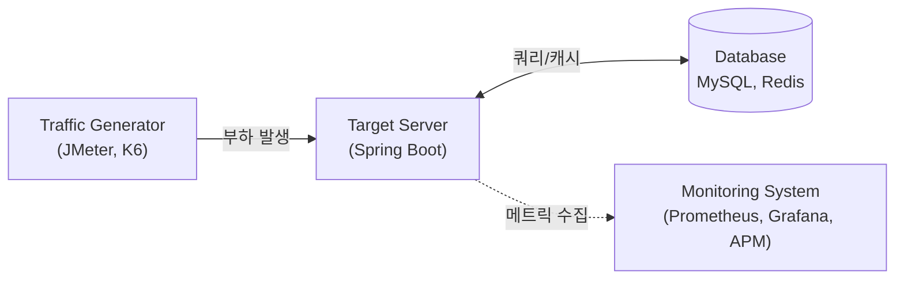

# 📈 성능 테스트 인터랙티브 시뮬레이터 (Performance Testing Simulator)

> **목적:** 대규모 트래픽 훈련 및 관제를 위해 백엔드 엔지니어들이 4대 성능 테스트(Load, Stress, Soak, Spike)의 동작 원리와 병목 현상을 눈으로 직접 보며 학습할 수 있도록 설계된 시각화 도구이다.

<br/>

## 📖 0. Quick Start Guide (사용 방법)

1. **시뮬레이터 시작하기:** 로컬 머신에서 프로젝트를 구동(`npm run dev`)하거나, 호스팅된 URL로 접속한다.
2. **테스트 아키텍처 이해하기:** 상단에 표기된 `Conceptual Architecture` 다이어그램을 보며 일반적인 트래픽-웹-DB 구조를 이해한다.
3. **학습 시나리오 재생 (기본):** 화면 중단의 `[Load Test]`, `[Stress Test]`, `[Soak Test]`, `[Spike Test]` 버튼을 하나씩 클릭한다.
   * 그래프가 그려지는 동안 4가지 지표(TPS, Response Time, CPU, Memory)의 상관관계를 관찰한다.
   * 하단의 텍스트 가이드에서 해당 테스트의 'Vibe(실무 분위기/현상)'를 읽어본다.
4. **사용자 정의 테스트 (고급):** 기본 동작 원리를 이해했다면 `[Custom (사용자 정의)]` 버튼을 클릭하여 목표 트래픽과 임계값을 직접 조절해가며 성능 변화를 예측해 본다.

<br/>

## 🏗️ 1. Architecture & Tech Stack

이 시뮬레이터는 복잡한 데이터베이스 설정 및 트래픽 제너레이터 없이, 프론트엔드 환경에서 실제 부하 테스트 시차/장애 시나리오를 수학적으로 모델링하여 시각화한다.

- **Frontend Stack**: React 19, TypeScript, Vite, Tailwind CSS
- **Charting Library**: Recharts (실시간 메트릭 변화 애니메이션 렌더링)
- **Simulated Target**: 일반적인 백엔드 아키텍처 환경 (웹 서버 + 데이터베이스)

### 시뮬레이터가 가정하는 아키텍처 (Conceptual Architecture)


<br/>

## 🎮 2. Test Scenarios (구현된 4대 시뮬레이션)

시뮬레이터의 버튼을 클릭하면, 실시간으로 다음 4가지 장애 및 부하 패턴이 우상향 그래프로 렌더링된다.

### 1) Load Test (부하 측정)
평상시 트래픽 상황의 안정성을 확인한다.

- **현상:** 500 TPS로 안정적으로 트래픽이 유입되며, CPU(45%), 메모리(40%), 응답 시간(50ms)이 평탄하게 유지된다.
- **포인트:** 예측 가능한 트래픽 상황에서 시스템이 이상적인 상태와 응답 시간을 유지하는지 확인.

### 2) Stress Test (한계점 도출)
서버가 감당할 수 없는 수준의 부하를 주어 병목 지점을 찾는다.

- **현상:** TPS가 한계점까지 지속 상승하다, 특정 임계점부터 CPU가 100% 포화되며, 결국 서버 다운 징후로 **TPS 0, 응답시간 폭증** 현상이 나타난다.
- **포인트:** 트래픽 증가에 따른 병목 지점 및 한계점(Connection Pool 고갈, CPU 상한 등) 파악.

### 3) Soak Test (내구성 및 누수 검증)
장기간 부하를 주어 메모리 누수나 자원 고갈을 찾는다.

- **현상:** 일정한 트래픽이 장기간 유지되나 백그라운드에서 **메모리(Memory) 사용률이 지속적으로 우상향**하여 결국 OOM(Out of Memory)으로 서버가 종료된다.
- **포인트:** 장기간 구동 상태(Endurance)에서 발생하는 코드 레벨의 **Memory Leak(누수)** 현상 탐지.

### 4) Spike Test (급증 부하 복원력)
갑작스러운 접속 폭주 이후 시스템이 다시 정상화되는지 확인한다.

- **현상:** 찰나의 순간에 TPS가 3,000 수준으로 치솟아 지연이 발생하지만, 스파이크 트래픽이 빠진 후 시스템 자원이 다시 정상 궤도로 회복한다.
- **포인트:** 선착순 이벤트 상황에서의 극단적 부하와, 순간적인 충격 이후 서버의 **복원력(Recovery)** 확인.

### 5) Custom Test (사용자 정의 샌드박스)
자유로운 파라미터 조정을 통해 시나리오를 설계하고 반응을 실습한다.

- **현상:** `목표 TPS`, `임계 TPS`, `지속 시간`, `메모리 누수 발생 여부`를 사용자가 직접 설정하여 테스트를 실행한다.
- **포인트:** 예상되는 이벤트 규모나 인프라 상한선 변경 시 시스템이 어떻게 반응할지, 특정 변수 조작에 따른 결과를 확인하여 트러블슈팅 및 용량 산정 능력을 기름.

<br/>

## 📊 3. Key Metrics & Dashboard

기존의 정적인 이미지를 대체하기 위해, 애플리케이션 내에 실시간 대시보드를 구축했다. 시뮬레이터를 통해 듀얼 Y축(Dual Y-Axis)으로 구성된 **4대 핵심 지표**를 직접 관찰해 보자.

| 지표 (Metric) | 차트 라인 컬러 & 스타일 | 관제 시나리오 가이드 |
| :--- | :--- | :--- |
| **TPS (처리량)** | 🔵 파란색 실선 (Blue Line) | 시스템이 초당 정상적으로 완료한 요청 수. 스트레스 구간에서 이 수치가 급감하면 서버가 한계에 다다른 것이다. |
| **Response Time (응답시간)** | 🔴 빨간색 점선 (Red Dashed) | 클라이언트가 대기한 시간. 임계점이 넘는 순간 급격하게 솟구치게 된다 (Timout의 주범). |
| **CPU Usage (리소스)** | 🟠 주황색 실선 (Orange Line) | 서버의 연산 부하량 (우측 Y축 단위 %). |
| **Memory Usage (메모리)** | 🟣 보라색 실선 (Purple Line) | 서버의 메모리 점유율. Soak Test 시 서서히 증가해 100%를 치는 누수 패턴을 살펴볼 수 있다. |

*※ 시뮬레이션 버튼을 누를 때마다 동적 수학 연산으로 그래프가 리얼타임으로 매 Tick 갱신된다.*

<br/>

## 💡 4. Vibe Coding Guide (실무 상황 맵핑)

차트 아래쪽에 표시되는 마크다운 가이드는 백엔드 주니어 개발자들이 체감할 수 있는 실제 "장애 현상" 텍스트를 제공한다.

- **Stress Vibe:** "사용자가 갑자기 폭증해서 서버가 죽을 때, DB 커넥션이 먼저 터지는지? CPU가 먼저 죽는지 찾아야 한다!"
- **Soak Vibe:** "3일간 켜둔 서버가 점점 느려지더니 OOM 예외를 던졌다. 타임아웃 방치나 객체 참조 해제 누락이 있는지 조사해야 한다."

<br/>

## 💻 5. How to Run Simulator

본 프로젝트는 의존성 복잡도가 낮은 순수 인터랙티브 프론트엔드 프로젝트(React+Vite)이다. 명령어를 통해 로컬 머신에서 바로 시각화 도구를 경험해 볼 수 있다.

### Prerequisites
- Node.js 설치 (v18 또는 상위 버전)

### Execution (Local Development)
```bash
# 1. 패키지 의존성(리액트, recharts, tailwind) 설치
npm install

# 2. 로컬 개발 서버 구동 (기본 포트 3000)
npm run dev
```

서버가 실행되면 웹 브라우저(`http://localhost:3000`)에 접속하여 **Load, Stress, Soak, Spike, Custom** 차트를 재생하고 지표 변화를 학습해 보자.
